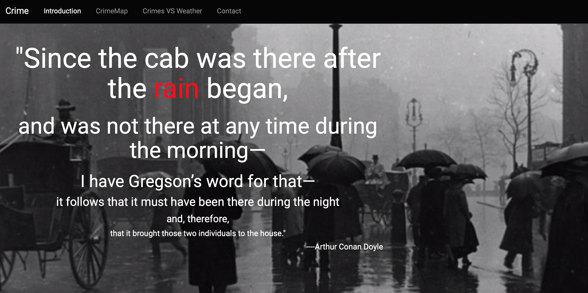
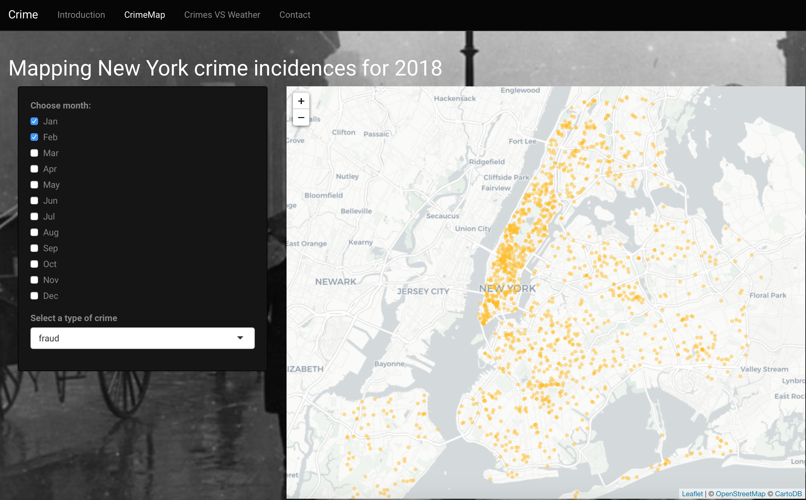
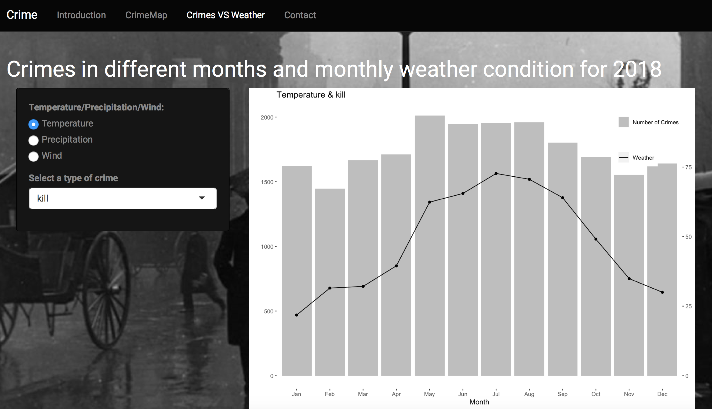

# Project 2: Shiny App Development Version 2.0




In this second project of GR5243 Applied Data Science, we develop a version 2.0 of an *Exploratory Data Analysis and Visualization* shiny app on a topic of your choice using [NYC Open Data](https://opendata.cityofnewyork.us/) or U.S. government open data released on the [data.gov](https://data.gov/) website. See [Project 2 Description](doc/project2_desc.md) for more details.  

The **learning goals** for this project is:

- business intelligence for data science
- study legacy codes and further development
- data cleaning
- data visualization
- systems development/design life cycle
- shiny app/shiny server

*The above general statement about project 2 can be removed once you are finished with your project. It is optional.

## Project Title: New York City Crime activities
Term: Fall 2019

+ Team # 2

+ **Link to Shiny App:** [shiny](https://xg2298.shinyapps.io/proj2/)
	+ Abrams, Zack zda2105@columbia.edu
	+ Gao, Xin xg2298@columbia.edu
	+ Gao, Zun zg2307@columbia.edu
	+ Meng, Yang ym2696@columbia.edu
	+ Ruan, Qiuyu qr2127@columbia.edu

+ **Project summary**:\\
Hotter temperatures may also lead to one unexpected result: a rise in violent crime. Research by Leah Schinasi and Ghassan Hamra, professors at Drexel University, has uncovered a strong link between hot weather in violent time by looking at data from Philadelphia over the course of ten years. Understanding the link between types of weather and crime rates and how crime is distributed over a geographic area could prove essential for the century to come. 

In our project, we analyzed data from  [NYC Open Data](https://data.cityofnewyork.us/Public-Safety/NYPD-Complaint-Data-Historic/qgea-i56i) to graph the link between different types of crime and the monthly average temperature, precipitation and wind speed, along with how that crime is spread throughout New York City in 2018. We think that this information could serve the efforts of local law enforcement, as well as companies in the ride-hailing and food delivery sectors, by making clear the areas that should be avoided given certain meteorological circumstances. 

**On the "Introduction" page：**
It is a quote from Conan Doyle.

**On the "CrimeMap" page：**
It is an interactive crime map in NYC. Users can select multiple months, from January to December, as well as a type of crime. So they can know how each kind of crime is distributed in a specific month range in 2018.
\\


**On the "Crimes VS weather" page：**
Users can get a view of the relationship between numbers of crimes and weather conditions. There are three options of weather conditions, including temperature, precipitation and wind speed. Also users can discover how the numbers of different types of crimes vary by month.



**On the "Contact" page：**
Users can find the team's contact information.

+ **Contribution statement**: ([default](doc/a_note_on_contributions.md)) \\

Introduction page: Xin Gao

cimeMap page-UI: Xin Gao

crimeMap page-Server: Xin Gao

Crime VS weather page-UI: Qiuyu Ruan, Yang Meng

Crime VS weather page-Server: Qiuyu Ruan, Yang Meng

Contact page: Qiuyu Ruan

Presentation: Zun Gao, Zack Abrams

Data cleaning: Xin Gao, Qiuyu Ruan, Yang Meng

Github arrangement: Yang Meng

Following [suggestions](http://nicercode.github.io/blog/2013-04-05-projects/) by [RICH FITZJOHN](http://nicercode.github.io/about/#Team) (@richfitz). This folder is orgarnized as follows.

```
proj/
├── app/
├── lib/
├── data/
├── doc/
└── output/
```

Please see each subfolder for a README file.

